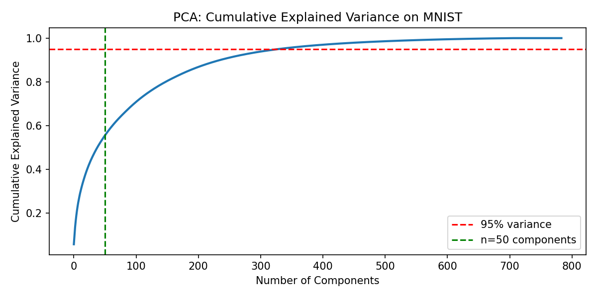

# MNIST Digit Classifier — PCA + PyTorch MLP

A comparison of raw vs. PCA-reduced input on MNIST digit classification using a PyTorch MLP. Built as an extension of a from-scratch K-Means implementation to explore how dimensionality reduction affects neural network performance and training efficiency.

---

## Results

| Metric | Raw (784-dim) | PCA (50-dim) |
|---|---|---|
| Input Dimensions | 784 | 50 |
| Retained Variance | 100% | 55.08% |
| Test Accuracy | 97.28% | 97.39% |
| Training Time | 83.9s | 55.3s |
| Speedup | — | 1.52x |

PCA reduces dimensionality by 93.6% (784 → 50 dims) while retaining only 55% of variance — yet matches raw pixel accuracy at 1.52x faster training.

---

## Architecture

**PCA:** `sklearn.decomposition.PCA` fit on standardized training data, reducing 784-dim pixel vectors to 50 principal components.

**MLP:**
```
Input (784 or 50) → Linear → ReLU → Dropout(0.2) → Linear → ReLU → Linear → 10-class output
```

Trained with Adam (lr=1e-3), CrossEntropyLoss, 15 epochs, batch size 64.

---

## Explained Variance Curve



---

## Setup

```bash
pip install torch scikit-learn numpy matplotlib
python Mnist-pca-mlp.py
```
